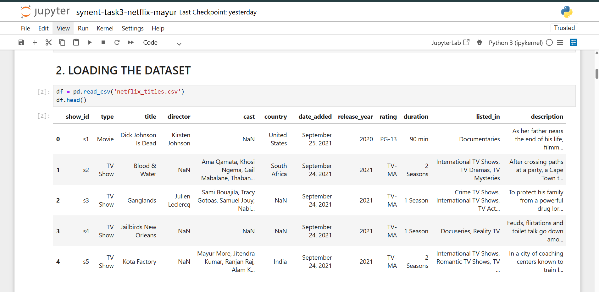
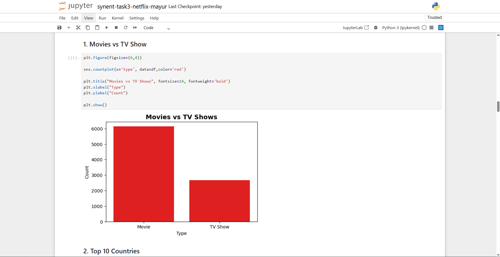
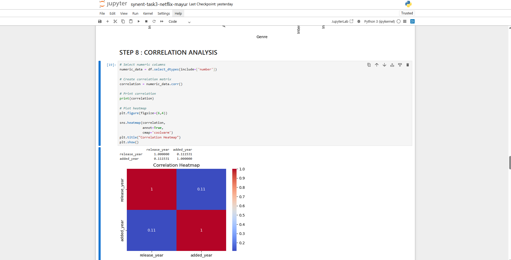
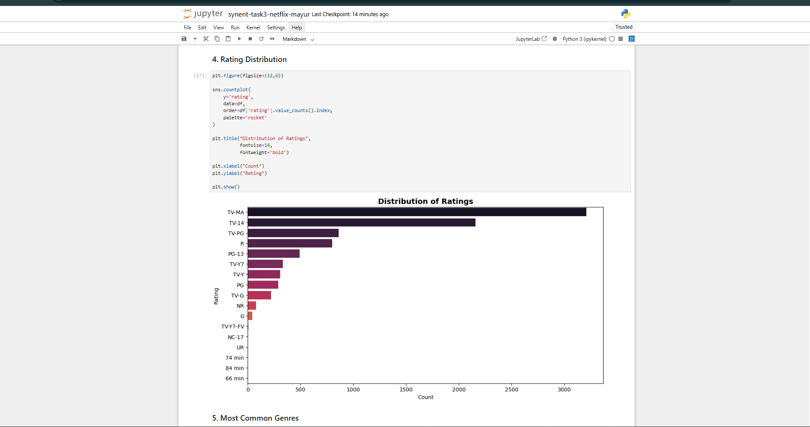
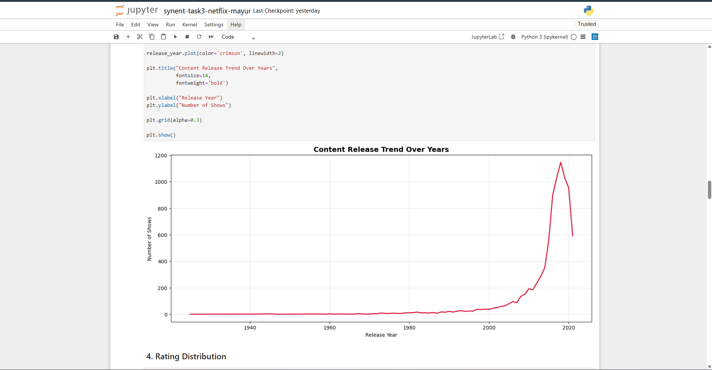

# 📊 Netflix EDA Project

## 📌 Objective
The objective of this project is to perform Exploratory Data Analysis (EDA) on the Netflix dataset to identify trends, patterns, and insights.

---

## 🛠 Technologies Used
- Python
- Pandas
- NumPy
- Matplotlib
- Seaborn

---

## 📂 Dataset
Netflix Movies and TV Shows Dataset

---

## 📈 Analysis Performed
- Movies vs TV Shows comparison
- Content added year-wise
- Country-wise analysis
- Ratings analysis
- Genre analysis
- Correlation heatmap

---

## 📊 Visualizations
- Bar Charts
- Histograms
- Heatmaps
- Line Charts

---

## ▶ Project Workflow
1. Data Cleaning  
2. Data Preprocessing  
3. Exploratory Data Analysis  
4. Data Visualization  
5. Insights Generation  

---

## 📌 Results
The project helped identify Netflix content trends and viewer content distribution patterns.

---

## 📸 Project Screenshots

### Dataset Preview

### Movies vs TV Shows

### Genre Analysis

### Heatmap

### Ratings Analysis

### Year Wise Content

---

## 👨‍💻 Author
Mayur Bavaskar
